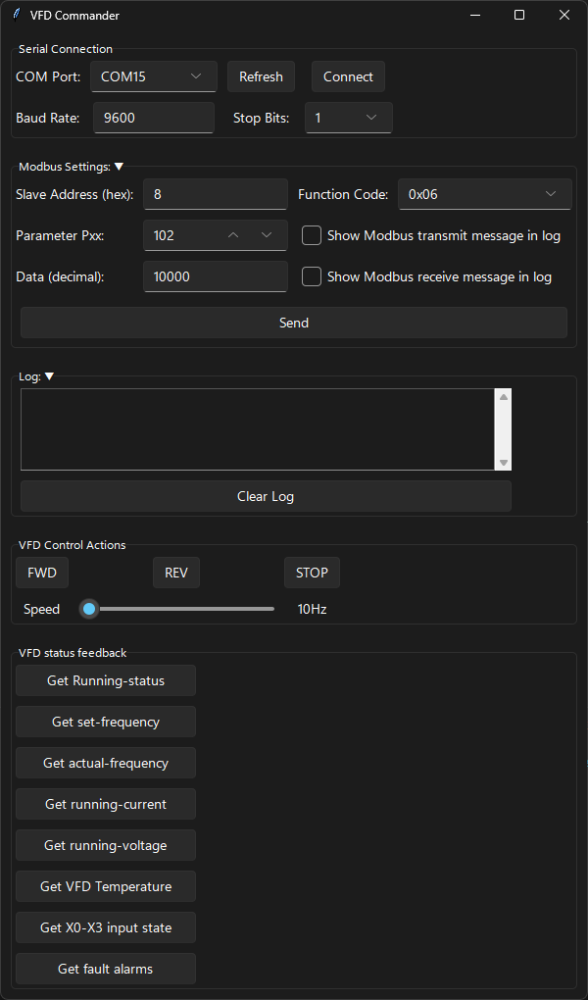
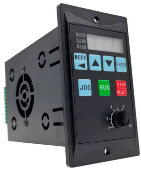
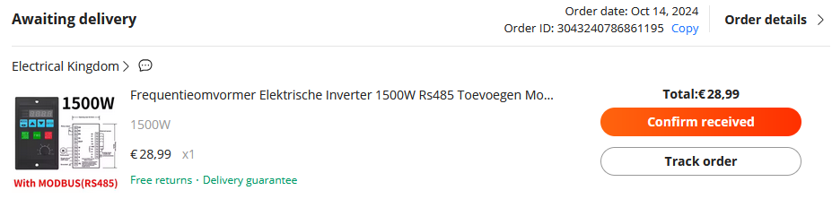

# VFD Commander

This Python-based graphical user interface (GUI) application is designed to facilitate communication between a computer and a Variable Frequency Drive (VFD) over an RS485 network. To use this tool, you will need a USB-to-RS485 transceiver.

The VFD operates using the MODBUS protocol, allowing for easy access and modification of all its parameters via the RS485 interface. This method is more convenient than interacting with the unit's display directly.

For detailed information on the VFD's parameters and their descriptions, refer to the manual located in the `doc` directory: `Manual 1.5KW+0.75KW+RS485 VFD Inverter.pdf`. Please note that some sections of this manual may be unclear due to potential translation issues from Chinese.

This tool is currently under development and is intended for initial testing purposes with the VFD. Despite its current state, I believe it will be useful for others, so I am sharing it here.


## Order info

**Frequency Converter Electric Inverter 1500W RS485 Add Motor Driver 0.75KW 1.5KW MCU Single Phase Input 220V 3-Phase Output 0.4KW**  

  
[Aliexpress link](https://vi.aliexpress.com/item/1005006401083753.html)  
 
NOTE! the 1500W version uses the same PCB as the 750W version. the power rating is listed on the PCB. However after contacting the seller he told me that the 1500W uses other components but the same PCB (I doubt this is really the case).  
!NOTE an RS485 USB tool and USB isolator (optional but recommended) have to be ordered sepperately.

## Overview

VFD Commander is a graphical user interface (GUI) application designed to interface and control an RS485 Variable Frequency Drive (VFD) using Modbus protocol. This tool provides users with the ability to set and retrieve various parameters of the VFD, such as frequency settings, direction of rotation, and more.

## Features

- **Set Setpoint-Frequency**: Adjusts the operating frequency of the VFD.
- **Get Setpoint-Frequency**: Retrieves the current setpoint frequency from the VFD.
- **Forward (FWD) Direction Control**: Starts the drive in forward direction.
- **Reverse (REV) Direction Control**: Starts the drive in reverse direction.

## Prerequisites

To run this application, you need to have the following installed:

- Python 3.x
- Required Python packages: `tkinter`, `pywinstyles`, `sv_ttk` (for GUI components), and any other dependencies used for Modbus communication.

You can install the necessary Python packages using pip:

```bash
pip install tkinter pywinstyles sv_ttk modbus-tk
```

## Usage

1. **Clone the Repository**:
    ```bash
    git clone https://github.com/yourusername/VFD-Commander.git
    cd VFD-Commander
    ```

2. **Run the Application**:
    ```bash
    python VFD_Commander.py
    ```

3. **Interact with the GUI**:
    - Use the frequency slider to set the desired operating frequency.
    - Click on "Get Setpoint-Frequency" to retrieve the current frequency setting from the VFD.
    - Use the "Forward" and "Reverse" buttons to control the direction of the drive.

## Contributing

Contributions are welcome! If you have any improvements or bug fixes, please open an issue or submit a pull request.

## License

This project is licensed under the MIT License. See the [LICENSE](LICENSE) file for details.